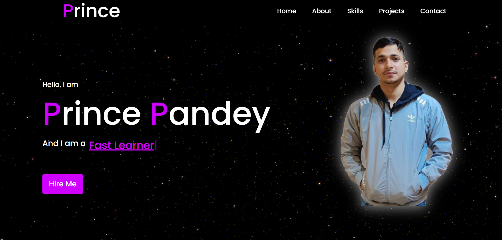
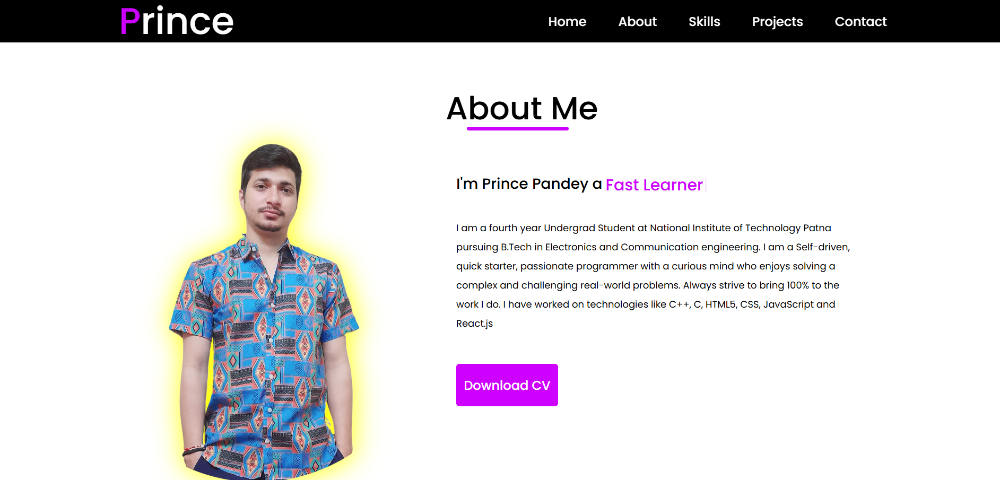
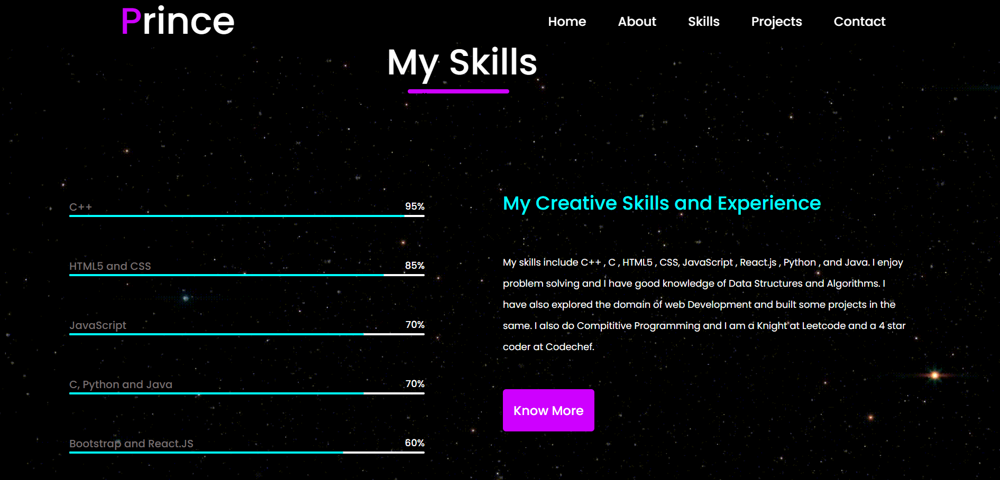
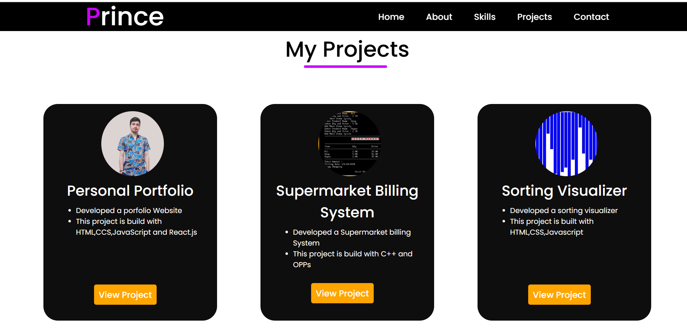
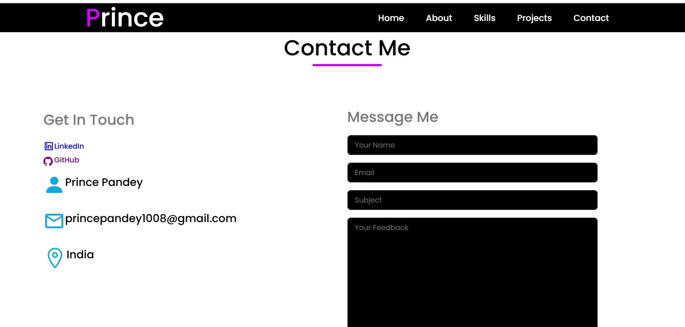

# 🌟 Personal Portfolio Website

This is my personal portfolio website created using **React.js**, where I showcase my projects, skills, experience, and a little about who I am as a developer. The goal of this site is to serve as a digital resume and make it easier for recruiters, hiring managers, or collaborators to learn more about me.

---

## 🎯 Objective

The portfolio serves as a hub where anyone can:

- Learn about my background and technical skills
- Explore the projects I’ve built
- Contact me for job opportunities or collaborations
- View a clean, responsive, and interactive interface

---

## 📌 Features

- **Animated Hero Section** – Eye-catching welcome message and “Hire Me” CTA.
- **About Me** – A brief summary of my background and career path.
- **Skills Section** – Highlights my frontend and programming knowledge.
- **Project Section** – Displays key personal and academic projects with descriptions and tech used.
- **Contact Section** – Easy way to reach me via email or social media.
- **Footer** – Clean ending section with copyright.

---

## 📸 Screenshots 
- **Hero Section**



- **About Section**  


- **Skills Section**  


- **Projects Section**  


- **Contact Me**  


## 🧠 What I Learned

During this project, I gained hands-on experience with:

- React.js and component-based architecture
- Handling props, state, and lifecycle in React
- Designing mobile-first responsive layouts using CSS Flexbox/Grid
- Implementing smooth scroll and UI animations
- Clean code organization and folder structuring in React apps

---

## 🛠️ Tech Stack

- **Frontend**: HTML5, CSS3, JavaScript (ES6+), React.js
- **Design**: Figma (for planning), custom CSS
- **Deployment**: GitHub Pages / Netlify (optional)
- **Version Control**: Git, GitHub

---

## 🚀 Getting Started Locally

To run this project on your machine:

```bash
# Clone the repository
git clone https://github.com/PrincePandey2002/portfolio.git

# Navigate into the folder
cd portfolio

# Install dependencies
npm install

# Run the development server
npm start
